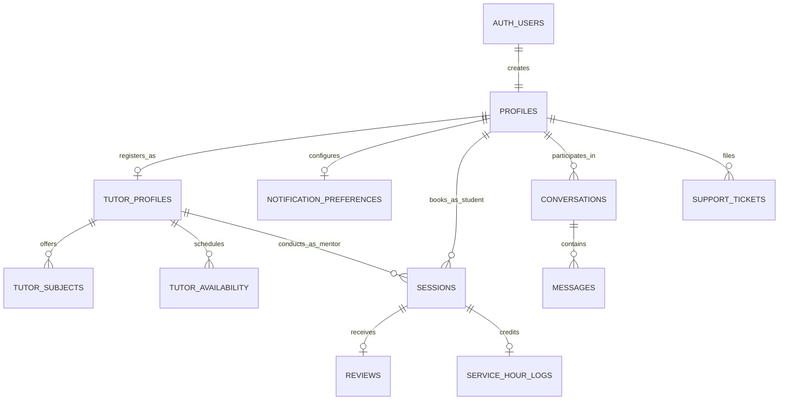

# Database & Schema Design Skill (MentorLinks)

## Goal

Design, optimize, and maintain a robust, normalized, and strictly secured **Supabase PostgreSQL** database architecture for **MentorLinks — Mentorship & Tutoring Matching Mobile Application** (*"Connect. Learn. Grow."*).

---

## 1. Database Standards & Golden Rules

1. **Schema Authority & Consistency:** Every table, constraint, and trigger must align with the pure mobile application architecture, direct-pay state machine, real-time in-app messaging, virtual classroom, and university community service hours workflow.
2. **Normalized 11-Table Schema:** Work strictly with confirmed tables:
   * **Identity & Profiles:** `profiles`, `tutor_profiles`
   * **Discovery & Scheduling:** `tutor_subjects`, `tutor_availability`
   * **Operations & Bookings:** `sessions`
   * **Social Proof & Accreditation:** `reviews`, `service_hour_logs`
   * **Communication & Engagement:** `conversations`, `messages`
   * **Support & User Preferences:** `support_tickets`, `notification_preferences`
3. **100% Row Level Security (RLS):** Every single table MUST execute `ALTER TABLE <table_name> ENABLE ROW LEVEL SECURITY;`. No table shall be exposed publicly without explicit RLS policies.
4. **Primary Identity Mapping:** `profiles.id` maps 1:1 with Supabase Auth `auth.users.id` via `ON DELETE CASCADE`.
5. **Safe & Non-Destructive Migrations:** Never execute blind `DROP TABLE` in production. Always write idempotent migration scripts using `IF NOT EXISTS` and `ADD COLUMN IF NOT EXISTS`.

---

## 2. Entity-Relationship Blueprint



### Table Definitions & Specifications

#### 1. `profiles`
Central user profile for students and peer mentors.
* `id` (`UUID`, PK, references `auth.users(id) ON DELETE CASCADE`)
* `full_name` (`VARCHAR(100)`, NOT NULL)
* `email` (`VARCHAR(255)`, NOT NULL, UNIQUE)
* `avatar_url` (`TEXT`)
* `account_type` (`VARCHAR(20)`, NOT NULL, DEFAULT `'student'`, CHECK in `'student'`, `'mentor'`)
* `education_level` (`VARCHAR(20)`, NOT NULL, DEFAULT `'college'`, CHECK in `'high_school'`, `'college'`)
* `school_name` (`VARCHAR(150)`, NOT NULL)
* `course_program` (`VARCHAR(150)`)
* `year_level` (`VARCHAR(50)`)
* `learning_interests` (`TEXT[]`, DEFAULT `'{}'`)
* `status_message` (`VARCHAR(120)`)
* `bio` (`TEXT`)
* `is_tutor` (`BOOLEAN`, NOT NULL, DEFAULT `false`)
* `created_at` (`TIMESTAMPTZ`, DEFAULT `now()`)
* `updated_at` (`TIMESTAMPTZ`, DEFAULT `now()`)

#### 2. `tutor_profiles`
Extended profile for peers providing tutoring/mentorship.
* `tutor_id` (`UUID`, PK, references `profiles(id) ON DELETE CASCADE`)
* `headline` (`VARCHAR(120)`, NOT NULL)
* `bio_experience` (`TEXT`)
* `hourly_rate` (`NUMERIC(10,2)`, NOT NULL, DEFAULT `0.00`, CHECK `hourly_rate >= 0.00`) — *₱0.00 for volunteer*
* `is_accepting_students` (`BOOLEAN`, NOT NULL, DEFAULT `true`)
* `total_service_hours` (`NUMERIC(6,2)`, NOT NULL, DEFAULT `0.00`)
* `average_rating` (`NUMERIC(3,2)`, NOT NULL, DEFAULT `5.00`, CHECK between `1.00` and `5.00`)
* `completed_sessions_count` (`INTEGER`, NOT NULL, DEFAULT `0`)
* `mentoring_style` (`VARCHAR(50)`, NOT NULL, DEFAULT `'one_on_one'`)
* `years_experience` (`INTEGER`, NOT NULL, DEFAULT `1`)
* `profile_visibility` (`BOOLEAN`, NOT NULL, DEFAULT `true`)
* `show_email` (`BOOLEAN`, NOT NULL, DEFAULT `false`)
* `default_duration_minutes` (`INTEGER`, NOT NULL, DEFAULT `60`, CHECK in `30, 45, 60`)
* `payment_instructions` (`TEXT`)
* `created_at` (`TIMESTAMPTZ`, DEFAULT `now()`)

#### 3. `tutor_subjects`
Academic subjects and topics a mentor is qualified to teach.
* `id` (`UUID`, PK, DEFAULT `gen_random_uuid()`)
* `tutor_id` (`UUID`, NOT NULL, references `tutor_profiles(tutor_id) ON DELETE CASCADE`)
* `subject_name` (`VARCHAR(100)`, NOT NULL)
* `category` (`VARCHAR(50)`, NOT NULL)
* `grade_level` (`VARCHAR(20)`, NOT NULL, DEFAULT `'both'`, CHECK in `'high_school'`, `'college'`, `'both'`)
* `proficiency_details` (`TEXT`)
* `created_at` (`TIMESTAMPTZ`, DEFAULT `now()`)

#### 4. `tutor_availability`
Weekly recurring schedule slots set by the mentor.
* `id` (`UUID`, PK, DEFAULT `gen_random_uuid()`)
* `tutor_id` (`UUID`, NOT NULL, references `tutor_profiles(tutor_id) ON DELETE CASCADE`)
* `day_of_week` (`SMALLINT`, NOT NULL, CHECK between `0` [Sun] and `6` [Sat])
* `start_time` (`TIME`, NOT NULL)
* `end_time` (`TIME`, NOT NULL)
* `is_active` (`BOOLEAN`, NOT NULL, DEFAULT `true`)

#### 5. `sessions`
Operational booking record and direct-pay state machine.
* `id` (`UUID`, PK, DEFAULT `gen_random_uuid()`)
* `student_id` (`UUID`, NOT NULL, references `profiles(id) ON DELETE CASCADE`)
* `tutor_id` (`UUID`, NOT NULL, references `tutor_profiles(tutor_id) ON DELETE CASCADE`)
* `subject_id` (`UUID`, references `tutor_subjects(id) ON DELETE SET NULL`)
* `scheduled_start` (`TIMESTAMPTZ`, NOT NULL)
* `scheduled_end` (`TIMESTAMPTZ`, NOT NULL)
* `duration_hours` (`NUMERIC(4,2)`, NOT NULL, DEFAULT `1.00`, CHECK `duration_hours > 0`)
* `meeting_type` (`VARCHAR(20)`, NOT NULL, DEFAULT `'online'`, CHECK in `'online'`, `'in_person'`)
* `meeting_link_or_location` (`TEXT`)
* `session_topic` (`TEXT`, NOT NULL)
* `student_note` (`TEXT`)
* `decline_reason` (`TEXT`)
* `status` (`VARCHAR(20)`, NOT NULL, DEFAULT `'pending'`, CHECK in `'pending'`, `'confirmed'`, `'completed'`, `'cancelled'`, `'declined'`)
* `payment_type` (`VARCHAR(20)`, NOT NULL, DEFAULT `'direct_pay'`, CHECK in `'direct_pay'`, `'volunteer_free'`)
* `payment_amount` (`NUMERIC(10,2)`, NOT NULL, DEFAULT `0.00`)
* `payment_status` (`VARCHAR(20)`, NOT NULL, DEFAULT `'unpaid'`, CHECK in `'unpaid'`, `'payment_submitted'`, `'confirmed'`)
* `payment_reference` (`VARCHAR(100)`)
* `session_notes` (`TEXT`)
* `counts_toward_service_hours` (`BOOLEAN`, NOT NULL, DEFAULT `false`)
* `created_at` (`TIMESTAMPTZ`, DEFAULT `now()`)

#### 6. `service_hour_logs`
Verifiable community service accreditation records for mentors.
* `id` (`UUID`, PK, DEFAULT `gen_random_uuid()`)
* `session_id` (`UUID`, UNIQUE, NOT NULL, references `sessions(id) ON DELETE CASCADE`)
* `tutor_id` (`UUID`, NOT NULL, references `profiles(id) ON DELETE CASCADE`)
* `student_id` (`UUID`, NOT NULL, references `profiles(id) ON DELETE CASCADE`)
* `subject_name` (`VARCHAR(100)`, NOT NULL)
* `hours_credited` (`NUMERIC(4,2)`, NOT NULL, CHECK `hours_credited > 0`)
* `verified_at` (`TIMESTAMPTZ`, DEFAULT `now()`)
* `notes` (`TEXT`)

#### 7. `reviews`
Post-session peer reviews and ratings.
* `id` (`UUID`, PK, DEFAULT `gen_random_uuid()`)
* `session_id` (`UUID`, UNIQUE, NOT NULL, references `sessions(id) ON DELETE CASCADE`)
* `student_id` (`UUID`, NOT NULL, references `profiles(id) ON DELETE CASCADE`)
* `tutor_id` (`UUID`, NOT NULL, references `tutor_profiles(tutor_id) ON DELETE CASCADE`)
* `rating` (`SMALLINT`, NOT NULL, CHECK between `1` and `5`)
* `comment` (`TEXT`)
* `created_at` (`TIMESTAMPTZ`, DEFAULT `now()`)

#### 8. `conversations`
1-on-1 direct chat threads between students and mentors.
* `id` (`UUID`, PK, DEFAULT `gen_random_uuid()`)
* `participant_one_id` (`UUID`, NOT NULL, references `profiles(id) ON DELETE CASCADE`)
* `participant_two_id` (`UUID`, NOT NULL, references `profiles(id) ON DELETE CASCADE`)
* `last_message_text` (`TEXT`)
* `last_message_at` (`TIMESTAMPTZ`, DEFAULT `now()`)
* `created_at` (`TIMESTAMPTZ`, DEFAULT `now()`)

#### 9. `messages`
Real-time messages sent within a conversation.
* `id` (`UUID`, PK, DEFAULT `gen_random_uuid()`)
* `conversation_id` (`UUID`, NOT NULL, references `conversations(id) ON DELETE CASCADE`)
* `sender_id` (`UUID`, NOT NULL, references `profiles(id) ON DELETE CASCADE`)
* `message_text` (`TEXT`, NOT NULL)
* `session_id` (`UUID`, references `sessions(id) ON DELETE SET NULL`)
* `is_read` (`BOOLEAN`, NOT NULL, DEFAULT `false`)
* `created_at` (`TIMESTAMPTZ`, DEFAULT `now()`)

#### 10. `support_tickets`
Help center questions and assistance inquiries.
* `id` (`UUID`, PK, DEFAULT `gen_random_uuid()`)
* `user_id` (`UUID`, NOT NULL, references `profiles(id) ON DELETE CASCADE`)
* `subject` (`VARCHAR(150)`, NOT NULL)
* `category` (`VARCHAR(50)`, NOT NULL)
* `message` (`TEXT`, NOT NULL)
* `status` (`VARCHAR(20)`, NOT NULL, DEFAULT `'open'`, CHECK in `'open'`, `'in_progress'`, `'resolved'`, `'closed'`)
* `created_at` (`TIMESTAMPTZ`, DEFAULT `now()`)

#### 11. `notification_preferences`
Push and in-app notification preferences per user.
* `user_id` (`UUID`, PK, references `profiles(id) ON DELETE CASCADE`)
* `session_reminders` (`BOOLEAN`, NOT NULL, DEFAULT `true`)
* `chat_messages` (`BOOLEAN`, NOT NULL, DEFAULT `true`)
* `booking_updates` (`BOOLEAN`, NOT NULL, DEFAULT `true`)
* `email_notifications` (`BOOLEAN`, NOT NULL, DEFAULT `false`)
* `updated_at` (`TIMESTAMPTZ`, DEFAULT `now()`)

---

## 3. Row Level Security (RLS) Policy Matrix

| Table | SELECT | INSERT | UPDATE | DELETE |
| :--- | :--- | :--- | :--- | :--- |
| **`profiles`** | Authenticated users | Own profile (`auth.uid() = id`) | Own profile (`auth.uid() = id`) | Disallowed |
| **`tutor_profiles`** | Authenticated (`visibility = true` or self) | Mentor (`auth.uid() = tutor_id`) | Mentor (`auth.uid() = tutor_id`) | Disallowed |
| **`tutor_subjects`** | Authenticated users | Mentor owner only | Mentor owner only | Mentor owner only |
| **`tutor_availability`** | Authenticated users | Mentor owner only | Mentor owner only | Mentor owner only |
| **`sessions`** | Involved Student or Mentor | Student (`auth.uid() = student_id`) | Student (ref submit) / Mentor (status, notes) | Disallowed |
| **`service_hour_logs`** | Involved Mentor or Student | Disallowed (Trigger managed) | Disallowed (Immutable) | Disallowed |
| **`reviews`** | Authenticated users | Attending student of completed session | Student owner | Disallowed |
| **`conversations`** | Thread participants | Thread participants | Disallowed | Disallowed |
| **`messages`** | Thread participants | Message sender | Participant (mark as read) | Disallowed |
| **`support_tickets`** | Ticket owner (`auth.uid() = user_id`) | Ticket owner (`auth.uid() = user_id`) | Disallowed | Disallowed |
| **`notification_preferences`** | Owner (`auth.uid() = user_id`) | Owner (`auth.uid() = user_id`) | Owner (`auth.uid() = user_id`) | Disallowed |

---

## 4. Key Performance Indexes

```sql
-- Search & Filter Indexes for Tutor Directory
CREATE INDEX IF NOT EXISTS idx_tutor_profiles_search ON tutor_profiles (is_accepting_students, hourly_rate);
CREATE INDEX IF NOT EXISTS idx_tutor_subjects_lookup ON tutor_subjects (subject_name, category);
CREATE INDEX IF NOT EXISTS idx_tutor_availability_slot ON tutor_availability (tutor_id, day_of_week, start_time);

-- Session Queries for Student & Mentor Views
CREATE INDEX IF NOT EXISTS idx_sessions_student_lookup ON sessions (student_id, status);
CREATE INDEX IF NOT EXISTS idx_sessions_tutor_lookup ON sessions (tutor_id, status);
CREATE INDEX IF NOT EXISTS idx_sessions_scheduled_start ON sessions (scheduled_start);

-- Accreditation & Review Indexes
CREATE INDEX IF NOT EXISTS idx_service_hours_tutor ON service_hour_logs (tutor_id, verified_at);
CREATE INDEX IF NOT EXISTS idx_reviews_tutor ON reviews (tutor_id, rating);

-- Messaging Indexes
CREATE INDEX IF NOT EXISTS idx_conversations_p1 ON conversations (participant_one_id);
CREATE INDEX IF NOT EXISTS idx_conversations_p2 ON conversations (participant_two_id);
CREATE INDEX IF NOT EXISTS idx_messages_conversation ON messages (conversation_id, created_at ASC);
CREATE INDEX IF NOT EXISTS idx_messages_sender ON messages (sender_id);
CREATE INDEX IF NOT EXISTS idx_support_tickets_user ON support_tickets (user_id, status);
```

---

## 5. Automated PostgreSQL Triggers

1. **User Auto-Creation (`handle_new_user`):** Initializes `profiles`, `notification_preferences`, and base `tutor_profiles` if registering as mentor.
2. **Service Hours Auto-Accreditation (`handle_session_completion_service_hours`):** Automatically logs hours and updates `total_service_hours` upon session completion for volunteer sessions.
3. **Rating Recalculation (`handle_tutor_rating_recalculation`):** Automatically computes aggregate rating and increments completed reviews count.
4. **Chat Message Snippet (`handle_new_chat_message`):** Updates conversation `last_message_text` and `last_message_at` on incoming message.
