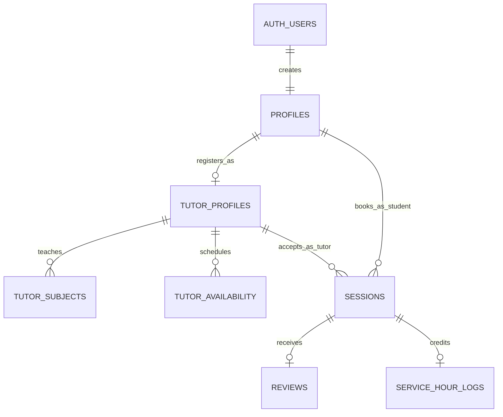

# Database & Schema Design Skill (MentorLink)

## Goal

Design, optimize, and maintain a robust, normalized, and strictly secured **Supabase PostgreSQL** database architecture for **MentorLink** — the peer mentorship and tutoring matching mobile application.

---

## 1. Database Standards & Golden Rules

1. **Schema Authority & Consistency:** Every table, constraint, and trigger must align with the pure mobile application architecture and direct-pay / community service hours workflow.
2. **Never Invent Phantom Tables:** Work strictly with confirmed tables:
   * Identity & Profiles: `profiles`, `tutor_profiles`
   * Discovery & Scheduling: `tutor_subjects`, `tutor_availability`
   * Operations & Bookings: `sessions`
   * Social Proof & Accreditation: `reviews`, `service_hour_logs`
3. **100% Row Level Security (RLS):** Every single table MUST execute `ALTER TABLE <table_name> ENABLE ROW LEVEL SECURITY;`. No table shall be exposed publicly without explicit RLS policies.
4. **Primary Identity Mapping:** `profiles.id` maps 1:1 with Supabase Auth `auth.users.id` via `ON DELETE CASCADE`.
5. **Safe & Non-Destructive Migrations:** Never execute blind `DROP TABLE` in production. Always write idempotent migration scripts using `IF NOT EXISTS` and `ADD COLUMN IF NOT EXISTS`.

---

## 2. Entity-Relationship Blueprint



### Table Definitions & Specifications

#### 1. `profiles`
Central user profile for both students and tutors.
* `id` (`UUID`, PK, references `auth.users(id) ON DELETE CASCADE`)
* `full_name` (`TEXT`, NOT NULL)
* `email` (`TEXT`, NOT NULL, UNIQUE)
* `avatar_url` (`TEXT`)
* `education_level` (`TEXT`, CHECK in `'high_school'`, `'college'`)
* `school_name` (`TEXT`, NOT NULL)
* `bio` (`TEXT`)
* `is_tutor` (`BOOLEAN`, DEFAULT `false`)
* `created_at` (`TIMESTAMPTZ`, DEFAULT `now()`)
* `updated_at` (`TIMESTAMPTZ`, DEFAULT `now()`)

#### 2. `tutor_profiles`
Extended profile for peers providing tutoring services.
* `tutor_id` (`UUID`, PK, references `profiles(id) ON DELETE CASCADE`)
* `hourly_rate` (`NUMERIC(10,2)`, DEFAULT `0.00`) — *₱0.00 for strictly volunteer tutoring*
* `is_accepting_students` (`BOOLEAN`, DEFAULT `true`)
* `headline` (`TEXT`) — *e.g., "BSCS Sophomore | Math & Programming Tutor"*
* `bio_experience` (`TEXT`)
* `total_service_hours` (`NUMERIC(6,2)`, DEFAULT `0.00`) — *Tally of accredited volunteer hours*
* `average_rating` (`NUMERIC(3,2)`, DEFAULT `5.00`)
* `completed_sessions_count` (`INTEGER`, DEFAULT `0`)
* `payment_instructions` (`TEXT`) — *e.g., GCash / Maya number or campus cash instructions*
* `created_at` (`TIMESTAMPTZ`, DEFAULT `now()`)

#### 3. `tutor_subjects`
Academic subjects and topics a tutor is qualified to teach.
* `id` (`UUID`, PK, DEFAULT `gen_random_uuid()`)
* `tutor_id` (`UUID`, references `tutor_profiles(tutor_id) ON DELETE CASCADE`)
* `subject_name` (`TEXT`, NOT NULL) — *e.g., "Calculus 1", "General Physics", "Python"*
* `category` (`TEXT`, NOT NULL) — *e.g., "Mathematics", "Science", "Computer Science"*
* `grade_level` (`TEXT`, NOT NULL) — *e.g., "High School", "College", "Both"*
* `created_at` (`TIMESTAMPTZ`, DEFAULT `now()`)

#### 4. `tutor_availability`
Weekly recurring schedule slots set by the tutor.
* `id` (`UUID`, PK, DEFAULT `gen_random_uuid()`)
* `tutor_id` (`UUID`, references `tutor_profiles(tutor_id) ON DELETE CASCADE`)
* `day_of_week` (`SMALLINT`, NOT NULL, CHECK between `0` [Sun] and `6` [Sat])
* `start_time` (`TIME`, NOT NULL)
* `end_time` (`TIME`, NOT NULL)
* `is_active` (`BOOLEAN`, DEFAULT `true`)

#### 5. `sessions`
The operational record of a scheduled tutoring booking.
* `id` (`UUID`, PK, DEFAULT `gen_random_uuid()`)
* `student_id` (`UUID`, NOT NULL, references `profiles(id) ON DELETE CASCADE`)
* `tutor_id` (`UUID`, NOT NULL, references `tutor_profiles(tutor_id) ON DELETE CASCADE`)
* `subject_id` (`UUID`, references `tutor_subjects(id) ON DELETE SET NULL`)
* `scheduled_start` (`TIMESTAMPTZ`, NOT NULL)
* `scheduled_end` (`TIMESTAMPTZ`, NOT NULL)
* `duration_hours` (`NUMERIC(4,2)`, NOT NULL)
* `meeting_type` (`TEXT`, NOT NULL, CHECK in `'online'`, `'in_person'`)
* `meeting_link_or_location` (`TEXT`) — *e.g., Google Meet URL or "Library 2nd Floor"*
* `session_topic` (`TEXT`, NOT NULL) — *Topic, homework, or exam description*
* `status` (`TEXT`, NOT NULL, DEFAULT `'pending'`, CHECK in `'pending'`, `'confirmed'`, `'completed'`, `'cancelled'`)
* `payment_type` (`TEXT`, NOT NULL, CHECK in `'direct_pay'`, `'volunteer_free'`)
* `payment_amount` (`NUMERIC(10,2)`, DEFAULT `0.00`)
* `payment_status` (`TEXT`, NOT NULL, DEFAULT `'unpaid'`, CHECK in `'unpaid'`, `'payment_submitted'`, `'confirmed'`)
* `payment_reference` (`TEXT`) — *Transaction reference number or note*
* `session_notes` (`TEXT`) — *Summary of topics covered and takeaways*
* `counts_toward_service_hours` (`BOOLEAN`, DEFAULT `false`)
* `created_at` (`TIMESTAMPTZ`, DEFAULT `now()`)

#### 6. `service_hour_logs`
Verifiable community service accreditation records for tutors.
* `id` (`UUID`, PK, DEFAULT `gen_random_uuid()`)
* `session_id` (`UUID`, UNIQUE, NOT NULL, references `sessions(id) ON DELETE CASCADE`)
* `tutor_id` (`UUID`, NOT NULL, references `profiles(id) ON DELETE CASCADE`)
* `student_id` (`UUID`, NOT NULL, references `profiles(id) ON DELETE CASCADE`)
* `subject_name` (`TEXT`, NOT NULL)
* `hours_credited` (`NUMERIC(4,2)`, NOT NULL)
* `verified_at` (`TIMESTAMPTZ`, DEFAULT `now()`)
* `notes` (`TEXT`)

#### 7. `reviews`
Post-session peer reviews and ratings.
* `id` (`UUID`, PK, DEFAULT `gen_random_uuid()`)
* `session_id` (`UUID`, UNIQUE, NOT NULL, references `sessions(id) ON DELETE CASCADE`)
* `student_id` (`UUID`, NOT NULL, references `profiles(id) ON DELETE CASCADE`)
* `tutor_id` (`UUID`, NOT NULL, references `tutor_profiles(tutor_id) ON DELETE CASCADE`)
* `rating` (`SMALLINT`, NOT NULL, CHECK between `1` and `5`)
* `comment` (`TEXT`)
* `created_at` (`TIMESTAMPTZ`, DEFAULT `now()`)

---

## 3. Row Level Security (RLS) Policy Matrix

| Table | SELECT | INSERT | UPDATE | DELETE |
| :--- | :--- | :--- | :--- | :--- |
| **`profiles`** | Public (authenticated users) | Own profile (`auth.uid() = id`) | Own profile (`auth.uid() = id`) | Disallowed |
| **`tutor_profiles`** | Public (authenticated users) | Own (`auth.uid() = tutor_id`) | Own (`auth.uid() = tutor_id`) | Disallowed |
| **`tutor_subjects`** | Public (authenticated users) | Tutor owner only | Tutor owner only | Tutor owner only |
| **`tutor_availability`** | Public (authenticated users) | Tutor owner only | Tutor owner only | Tutor owner only |
| **`sessions`** | Involved Student or Tutor | Authenticated Student | Involved Student or Tutor (role-scoped) | Only `pending` sessions by Student |
| **`service_hour_logs`** | Tutor owner or Student | Inserted via trigger/service function | Disallowed (Immutable) | Disallowed |
| **`reviews`** | Public (authenticated users) | Student of completed session | Student owner | Disallowed |

---

## 4. Key Performance Indexes

```sql
-- Fast lookup for tutor searches by subject and availability
CREATE INDEX IF NOT EXISTS idx_tutor_subjects_name ON tutor_subjects (subject_name);
CREATE INDEX IF NOT EXISTS idx_tutor_subjects_category ON tutor_subjects (category);
CREATE INDEX IF NOT EXISTS idx_tutor_availability_tutor_day ON tutor_availability (tutor_id, day_of_week);

-- Fast lookup for student and tutor active sessions
CREATE INDEX IF NOT EXISTS idx_sessions_student_id ON sessions (student_id);
CREATE INDEX IF NOT EXISTS idx_sessions_tutor_id ON sessions (tutor_id);
CREATE INDEX IF NOT EXISTS idx_sessions_status ON sessions (status);
CREATE INDEX IF NOT EXISTS idx_sessions_start ON sessions (scheduled_start);

-- Fast lookup for accreditation and ratings
CREATE INDEX IF NOT EXISTS idx_reviews_tutor_id ON reviews (tutor_id);
CREATE INDEX IF NOT EXISTS idx_service_hours_tutor_id ON service_hour_logs (tutor_id);
```

---

## 5. Automated PostgreSQL Triggers

### A. Automatic Rating & Review Tally
When a new review is inserted into `reviews`, automatically recalculate `average_rating` and increment `completed_sessions_count` in `tutor_profiles`.

### B. Automatic Service Hours Credit
When a session with `counts_toward_service_hours = true` updates its status to `'completed'`, automatically:
1. Insert a verifiable entry into `service_hour_logs`.
2. Add `duration_hours` to `total_service_hours` in `tutor_profiles`.

---

## 6. Review & Migration Workflow

When modifying or expanding the database:
1. Check foreign key cascading behaviors to prevent orphaned sessions or reviews.
2. Verify that RLS policies prevent students from approving their own sessions or altering payment status.
3. Keep all SQL scripts idempotent (`CREATE TABLE IF NOT EXISTS`, `DO $$ BEGIN ... END $$`).
4. Document all schema updates in `docs/supabase_schema_setup.sql`.
