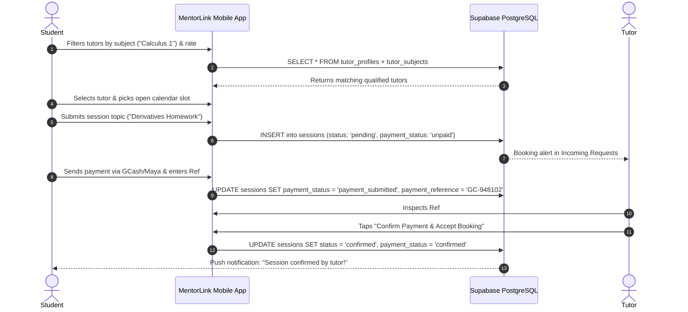
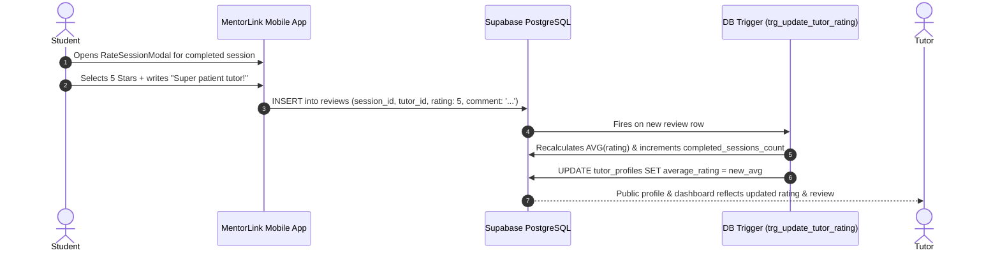

# End-to-End System Flow Skill (MentorLink)

## Goal

Provide a definitive, unified map of the entire peer mentorship and tutoring matching lifecycle linking **Student (Learner)**, **Peer Tutor (Mentor)**, **Direct Payment Tracking**, **Session Execution**, and **University Community Service Hours Accreditation** in **MentorLink**.

---

## 1. High-Level System Lifecycle Overview

```
┌─────────────────────────────────────────────────────────────────────────────┐
│                       MENTORLINK SYSTEM LIFECYCLE MAP                       │
└─────────────────────────────────────────────────────────────────────────────┘

  [1. ONBOARDING & PROFILE SETUP]
       User creates account (High School or College, School Name).
       Peer Tutor activates Mentor Mode: sets bio, qualified subjects, 
       hourly rate (or ₱0 volunteer), payment info, & weekly availability slots.
                                     │
                                     ▼
  [2. DISCOVERY & FILTERING]
       Student searches by Subject/Topic (e.g., Pre-Calculus, Java Programming) -> 
       filters by Grade Level, Rate (Free vs. Paid), & Available Days ->
       views Tutor Profile, reviews, and open calendar slots.
                                     │
                                     ▼
  [3. BOOKING INITIATION & DIRECT PAYMENT]
       Student selects time slot & inputs topic/homework details ->
       Session created (status: 'pending', payment_status: 'unpaid') ->
       Student transfers payment directly (GCash / Maya / Cash) & submits Reference # ->
       Session updates (payment_status: 'payment_submitted').
                                     │
                                     ▼
  [4. TUTOR CONFIRMATION]
       Tutor verifies payment receipt -> accepts booking ->
       Session updates (status: 'confirmed', payment_status: 'confirmed') ->
       Meeting link / campus location shared with both student and tutor.
       *(Volunteer sessions bypass payment and confirm directly upon acceptance)*
                                     │
                                     ▼
  [5. SESSION EXECUTION & NOTES]
       Student and Tutor meet at scheduled time ->
       Tutor records key Session Notes & study takeaways in app ->
       Tutor marks session as 'completed'.
                                     │
                                     ▼
  [6. ACCREDITATION & PEER REVIEW]
       ├─► STUDENT: Leaves 1–5 star rating & feedback -> updates Tutor average rating.
       └─► TUTOR: If volunteer session -> PostgreSQL trigger automatically credits 
           hours to `total_service_hours` & generates verifiable record in 
           `service_hour_logs` for university accreditation export.
```

---

## 2. Cross-Role Mobile Screen Mapping Matrix

Every action performed by a Student has a direct, synchronized reflection in the Tutor’s mobile interface:

| Domain / Lifecycle | Student (Learner) Mobile View | Peer Tutor (Mentor) Mobile View | Shared Supabase Table(s) |
| :--- | :--- | :--- | :--- |
| **Profile & Onboarding** | `ProfileScreen.jsx` (Student info, school name) | `TutorSetupScreen.jsx` (Subjects, rate, bio) | `profiles`, `tutor_profiles` |
| **Discovery & Search** | `FindTutorScreen.jsx` (Filters, search bar) | `TutorCard.jsx` (Public preview of tutor profile) | `tutor_profiles`, `tutor_subjects` |
| **Availability & Slots** | `SlotPickerModal.jsx` (Selects available slot) | `ManageScheduleScreen.jsx` (Sets recurring days/hours) | `tutor_availability` |
| **Booking & Payment** | `BookSessionScreen.jsx` (Topic input, submits Ref #) | `IncomingBookingsScreen.jsx` (Reviews request & Ref #) | `sessions` |
| **Payment Verification** | `SessionCard.jsx` (Status: "Payment Submitted") | `ConfirmPaymentModal.jsx` (Tutor clicks "Confirm") | `sessions` |
| **Active / Upcoming** | `MySessionsScreen.jsx` (Join meeting link, location) | `TutorSessionsScreen.jsx` (Upcoming sessions list) | `sessions` |
| **Session Notes** | `SessionDetailsScreen.jsx` (Reads summary notes) | `SessionNotesPad.jsx` (Tutor drafts & saves notes) | `sessions` |
| **Session Completion** | Receives completion prompt | Clicks "Mark Completed" button | `sessions` |
| **Service Hours** | *N/A (Learner does not track)* | `ServiceHoursScreen.jsx` (Verifiable hours summary) | `service_hour_logs`, `tutor_profiles` |
| **Ratings & Feedback** | `RateSessionModal.jsx` (Submits 1–5 stars & review) | `TutorReviewsScreen.jsx` (Views feedback received) | `reviews`, `tutor_profiles` |

---

## 3. Detailed End-to-End Sequence Flows

### Flow A: Discovery, Booking, & Direct Pay Verification



---

### Flow B: Session Completion, Notes Pad, & Community Hours Auto-Accreditation

```mermaid
sequenceDiagram
    autonumber
    actor Tutor
    participant App as MentorLink Mobile App
    participant DB as Supabase PostgreSQL
    participant Trigger as DB Trigger (trg_credit_service_hours)
    actor Student

    Note over Tutor, Student: Session conducted via Google Meet or in-person library
    Tutor->>App: Opens Session Notes Pad & types key concepts covered
    App->>DB: UPDATE sessions SET session_notes = 'Reviewed chain rule & product rule'
    Tutor->>App: Taps "Mark Session Completed"
    App->>DB: UPDATE sessions SET status = 'completed'
    alt If counts_toward_service_hours == true (Volunteer)
        DB->>Trigger: Fires on status = 'completed'
        Trigger->>DB: INSERT into service_hour_logs (tutor_id, hours, subject)
        Trigger->>DB: UPDATE tutor_profiles SET total_service_hours += duration_hours
    end
    DB-->>Student: Session status changes to 'Completed'; unlocks "Rate Tutor" button
    DB-->>Tutor: Tutor sees total accredited hours incremented in Service Hours tab
```

---

### Flow C: Peer Review & Rating Recalculation



---

## 4. State Machine Consistency Rules

### `sessions.status` Lifecycle:
1. `pending`: Initial state upon booking creation.
2. `confirmed`: Transitioned only when tutor accepts (and verifies payment, if applicable).
3. `completed`: Transitioned only when tutor marks the session finished.
4. `cancelled`: Allowed by student (if still `pending`) or by tutor (with notice).

### `sessions.payment_status` Lifecycle:
1. `unpaid`: Initial state when booked.
2. `payment_submitted`: Student has transferred funds and provided the reference number.
3. `confirmed`: Tutor verified the payment in their payment app and confirmed receipt.
*(For volunteer sessions with rate ₱0.00, `payment_status` defaults to `confirmed` automatically).*

---

## 5. End-to-End Checklist for Developers & Agents

Before implementing or connecting any module:

1. **Verify Dual-Perspective Impact:** Does a change made by the Student immediately update the corresponding Tutor screen (and vice-versa)?
2. **Verify Payment State Safety:** Is the student restricted to submitting payment references, while only the tutor has the button to confirm?
3. **Verify Community Hours Trigger:** Does marking a volunteer session as `completed` automatically record a row in `service_hour_logs` and update `total_service_hours`?
4. **Verify Mobile Viewport Layout:** Are all views tested for mobile responsiveness ($360\text{px}$–$430\text{px}$) with proper bottom navigation clearance?
