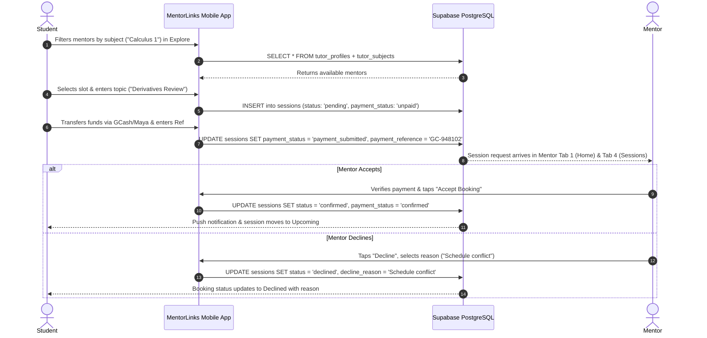
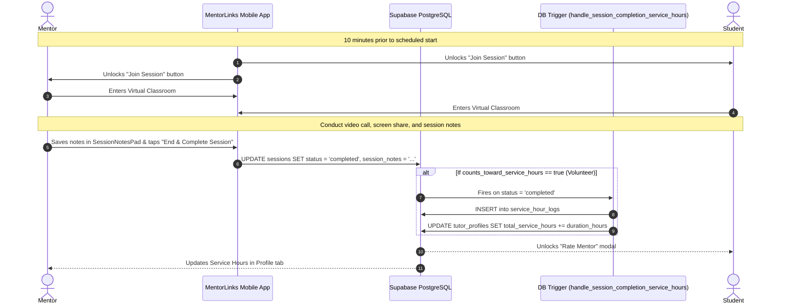

# End-to-End System Flow Skill (MentorLinks)

## Goal

Provide a definitive, unified map of the entire peer mentorship lifecycle linking **Student (Learner)**, **Peer Mentor (Tutor)**, **Direct Payment Tracking**, **In-App Messaging**, **Virtual Classroom**, and **University Community Service Hours Accreditation** in **MentorLinks** (*"Connect. Learn. Grow."*).

---

## 1. High-Level System Lifecycle Overview

```
┌─────────────────────────────────────────────────────────────────────────────┐
│                      MENTORLINKS SYSTEM LIFECYCLE MAP                       │
└─────────────────────────────────────────────────────────────────────────────┘

  [1. ONBOARDING & PROFILE SETUP]
       User creates account (Student or Mentor, School, Course, Year Level, Interests).
       Mentor activates profile: sets bio, subjects, rate (or ₱0 volunteer), 
       mentoring style, and weekly availability slots.
                                     │
                                     ▼
  [2. DISCOVERY & FILTERING (Student Explore Tab)]
       Student searches by Subject/Topic -> filters by Category, Rate, & Day ->
       views Mentor Profile, ratings, and open calendar slots.
                                     │
                                     ▼
  [3. BOOKING INITIATION & DIRECT PAYMENT]
       Student selects time slot & inputs topic/homework details ->
       Session created (status: 'pending', payment_status: 'unpaid') ->
       Student transfers payment directly (GCash / Maya / Cash) & submits Reference # ->
       Session updates (payment_status: 'payment_submitted').
                                     │
                                     ▼
  [4. MENTOR CONFIRMATION / DECLINE]
       Mentor reviews request in Incoming Requests / Sessions tab:
       ├─► ACCEPT: Verifies payment -> status = 'confirmed', payment_status = 'confirmed'.
       └─► DECLINE: Selects reason -> status = 'declined', decline_reason = '...'.
       *(Volunteer sessions bypass payment and confirm directly upon acceptance)*
                                     │
                                     ▼
  [5. REAL-TIME CHAT & VIRTUAL CLASSROOM]
       Student & Mentor chat in-app with embedded session reminder card.
       10 minutes prior to scheduled start -> "Join Session" unlocks ->
       Both launch in-app Virtual Classroom (video, audio, chat, screen share).
                                     │
                                     ▼
  [6. SESSION EXECUTION, NOTES & COMPLETION]
       Mentor drafts post-session study takeaways in SessionNotesPad ->
       Mentor marks session 'completed'.
                                     │
                                     ▼
  [7. ACCREDITATION & PEER REVIEW]
       ├─► STUDENT: Leaves 1–5 star rating & review -> recalculates Mentor average rating.
       └─► MENTOR: If volunteer session -> PostgreSQL trigger automatically credits 
           hours to `total_service_hours` & generates verifiable record in 
           `service_hour_logs` for university accreditation export.
```

---

## 2. Cross-Role Mobile Screen Mapping Matrix (Dual 5-Tab Architecture)

| Lifecycle Stage | Student Mobile View (5 Tabs) | Mentor Mobile View (5 Tabs) | Shared Supabase Table(s) |
| :--- | :--- | :--- | :--- |
| **Tab 1: Home** | `StudentHomeScreen.jsx` (Hero, stats, next session, recommended mentors) | `MentorHomeScreen.jsx` (2x2 stats, pending requests, upcoming sessions) | `profiles`, `tutor_profiles`, `sessions` |
| **Tab 2: Directory / Roster** | `ExploreScreen.jsx` (Search, category filters, mentor list) | `StudentsRosterScreen.jsx` (Active & past mentees, search, chat trigger) | `tutor_profiles`, `tutor_subjects`, `sessions` |
| **Tab 3: Messaging** | `MessagesScreen.jsx` $\rightarrow$ `ChatDetailScreen.jsx` | `MessagesScreen.jsx` $\rightarrow$ `ChatDetailScreen.jsx` | `conversations`, `messages`, `sessions` |
| **Tab 4: Sessions** | `StudentSessionsScreen.jsx` (`Upcoming`, `Completed`, `Cancelled`) | `MentorSessionsScreen.jsx` (`Upcoming`, `Requests`, `Completed`) | `sessions`, `tutor_subjects` |
| **Tab 5: Profile** | `StudentProfileScreen.jsx` (Interests, progress, support) | `MentorProfileScreen.jsx` (Schedule, subjects, service hours export) | `profiles`, `tutor_profiles`, `service_hour_logs` |
| **Booking Flow** | `BookSessionScreen.jsx` (Slot selection, payment ref submit) | `IncomingBookingsScreen.jsx` (Accept/Decline modal) | `sessions`, `tutor_availability` |
| **Virtual Classroom** | `VirtualClassroomScreen.jsx` (Video stream, meeting controls) | `VirtualClassroomScreen.jsx` (Video stream, meeting controls, notes) | `sessions` |
| **Post-Session Notes**| `SessionDetailsScreen.jsx` (Reads study takeaways) | `SessionNotesPad.jsx` (Writes & saves study notes) | `sessions` |
| **Accreditation Export**| *N/A (Learner does not track)* | `ServiceHoursScreen.jsx` (Printable community service summary) | `service_hour_logs`, `tutor_profiles` |
| **Ratings & Feedback** | `RateSessionModal.jsx` (Submits 1–5 stars + review) | `MentorReviewsScreen.jsx` (Views received peer feedback) | `reviews`, `tutor_profiles` |

---

## 3. Detailed Sequence Diagrams

### Flow A: Booking Request, Direct Pay & Mentor Confirmation/Decline



---

### Flow B: Virtual Classroom & Community Service Hours Accreditation



---

## 4. State Machine Consistency Rules

### `sessions.status` Lifecycle:
1. `pending`: Initial state upon booking creation.
2. `confirmed`: Transitioned only when mentor accepts (and confirms payment, if applicable).
3. `declined`: Mentor rejects booking with specified `decline_reason`.
4. `completed`: Transitioned only when mentor marks the session finished.
5. `cancelled`: Allowed by student (if still `pending`) or by mentor (with notice).

### `sessions.payment_status` Lifecycle:
1. `unpaid`: Initial state when booked.
2. `payment_submitted`: Student has transferred funds and entered the reference number.
3. `confirmed`: Mentor verified payment in their payment app and confirmed receipt.
*(For volunteer sessions with rate ₱0.00, `payment_status` defaults to `confirmed` automatically).*

---

## 5. End-to-End Cross-Role Checklist

1. **Verify Dual-Perspective Impact:** Does a change made by the Student immediately update the corresponding Mentor screen (and vice-versa)?
2. **Verify Payment State Safety:** Is the student restricted to submitting payment references, while only the mentor has the button to confirm?
3. **Verify Decline Flow:** Does declining require a reason and set status to `declined` cleanly?
4. **Verify Community Hours Trigger:** Does marking a volunteer session as `completed` automatically record a row in `service_hour_logs` and update `total_service_hours`?
5. **Verify 5-Tab Navigation:** Are all views appropriately routed for Student vs Mentor with `pb-24` clearance?
