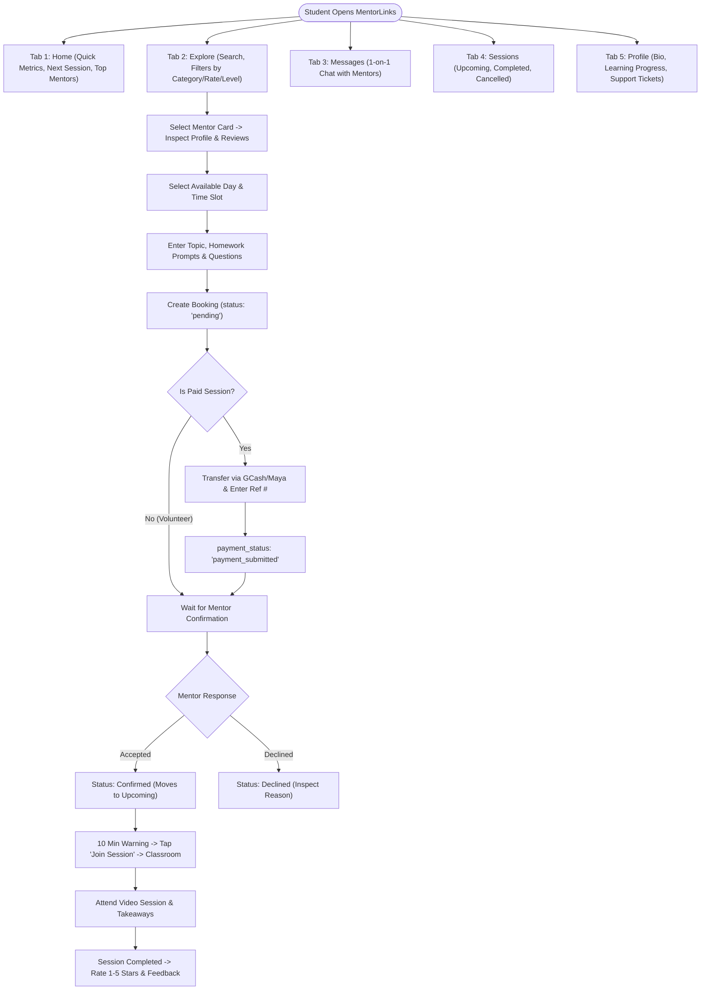
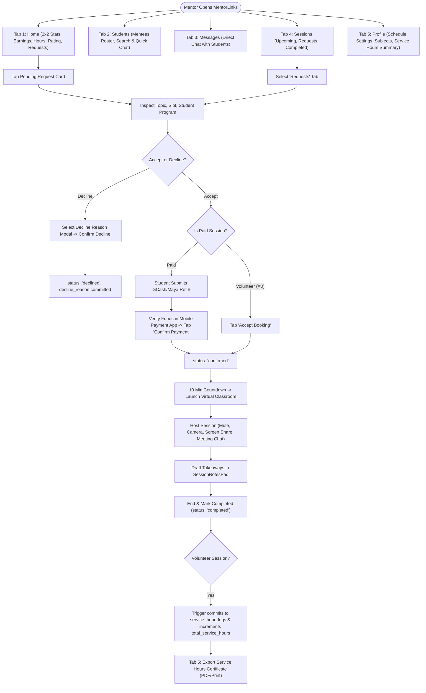
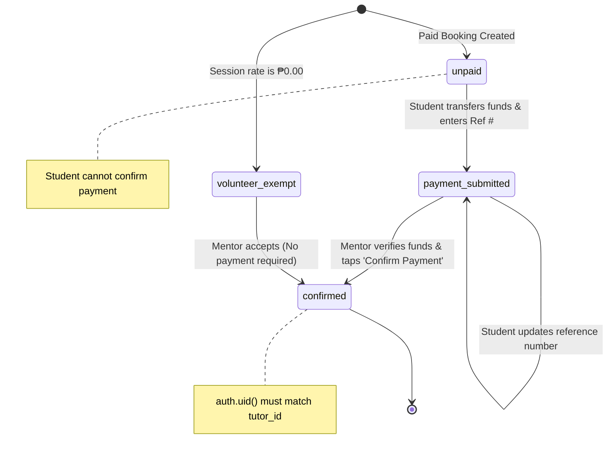
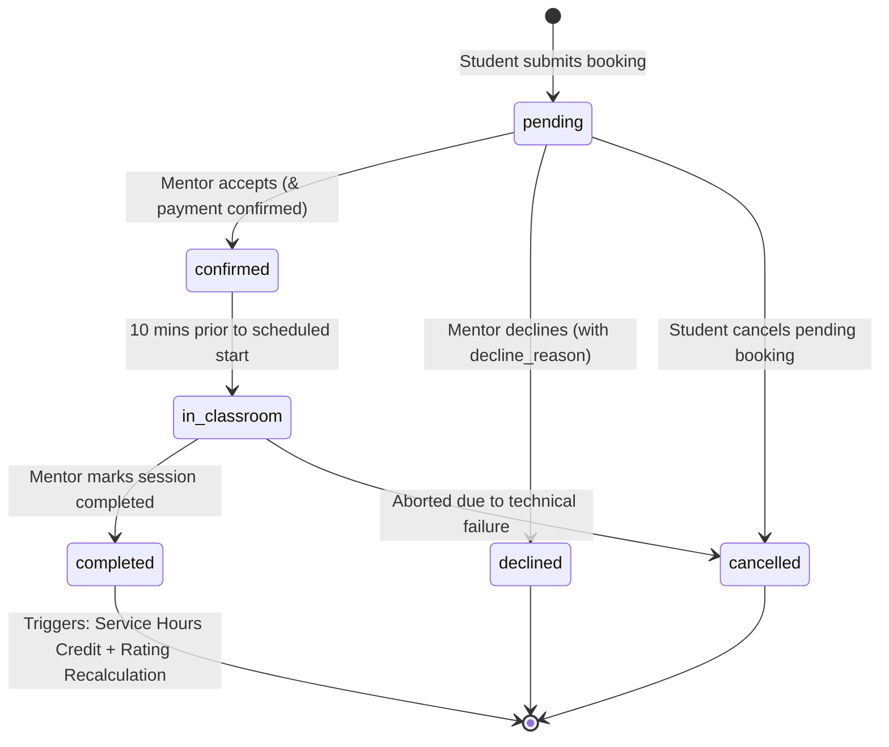

# MentorLinks — System Flowcharts & Lifecycle State Diagrams

**Project Title:** MentorLinks — Mentorship & Tutoring Matching Mobile Application  
**Tagline:** *"Connect. Learn. Grow."*  
**Document Purpose:** Comprehensive visual flowcharts, decision trees, and state machine diagrams mapping 100% of the end-to-end multi-role workflows across Students, Peer Mentors, Direct Payments, In-App Messaging, Virtual Classroom, Database Triggers, and University Service Hours Accreditation.  
**Target Location:** `docs/system_flowchart.md`  
**Version:** 2.0  

---

## 1. Master End-to-End System Flowchart

```mermaid
flowchart TD
    Start(["User Launches MentorLinks"]) --> Auth{"Authenticated?"}
    Auth -- "No" --> Register["Sign Up / Login (Student vs Mentor Account)"]
    Auth -- "Yes" --> CheckRole{"Active Role in AppContext"}
    Register --> CheckRole

    %% Dual 5-Tab Shell Routing
    CheckRole -- "Student Mode" --> S_Tabs["Student 5 Tabs: Home | Explore | Messages | Sessions | Profile"]
    CheckRole -- "Mentor Mode" --> M_Tabs["Mentor 5 Tabs: Home | Students | Messages | Sessions | Profile"]

    %% Student Discovery & Booking Flow
    S_Tabs --> S_Explore["Explore Tab: Search & Filter Mentors"]
    S_Explore --> S_Profile["View Mentor Profile & Subjects"]
    S_Profile --> S_Book["Book Session: Select Slot & Topic"]
    S_Book --> S_Submit["Submit Request (status: 'pending')"]

    %% Mentor Processing
    S_Submit --> M_Notify["Mentor Receives Request in Home & Sessions Tabs"]
    M_Tabs --> M_Sessions["Sessions Tab: Review Incoming Requests"]
    M_Notify --> M_Sessions

    M_Sessions --> M_Decision{"Mentor Decision"}
    M_Decision -- "Decline" --> M_DeclineReason["Select Reason (Schedule Conflict, etc.)"]
    M_DeclineReason --> S_Declined["status: 'declined', decline_reason set"]

    M_Decision -- "Accept" --> RateCheck{"Session Rate?"}
    RateCheck -- "Paid (₱Rate/hr)" --> S_Pay["Student Transfers via GCash/Maya & Submits Ref #"]
    S_Pay --> M_VerifyPay{"Mentor Verifies Ref # in Payment App"}
    M_VerifyPay -- "Verified" --> ConfirmedSession["status: 'confirmed', payment_status: 'confirmed'"]

    RateCheck -- "Volunteer (₱0.00)" --> ConfirmedSession

    %% Real-time Chat & Virtual Classroom
    ConfirmedSession --> ChatThread["In-App Messaging with Session Shortcut Card"]
    ConfirmedSession --> TimeGate{"10 Mins Before Start?"}
    TimeGate -- "Yes" --> Classroom["Unlock 'Join Session' -> In-App Virtual Classroom"]

    %% Meeting & Completion
    Classroom --> ConductSession["Conduct Call (Video, Audio, Screen Share)"]
    ConductSession --> SaveNotes["Mentor Drafts Notes in SessionNotesPad"]
    SaveNotes --> CompleteSession["Mentor Taps 'End & Complete' (status: 'completed')"]

    %% Post-Session Outcomes
    CompleteSession --> StudentRate["Student Submits 1-5 Star Review -> Recalculates Rating"]
    CompleteSession --> ServiceCheck{"Volunteer Session?"}
    ServiceCheck -- "Yes" --> AutoCredit["DB Trigger: Commit to service_hour_logs & Add Hours"]
    AutoCredit --> ExportCert["Mentor Exports Service Hours Certificate"]
    ServiceCheck -- "No" --> Finalize(["Session Finalized"])
    ExportCert --> Finalize
    StudentRate --> Finalize
```

---

## 2. Student 5-Tab User Journey Flowchart

---

## 3. Mentor 5-Tab User Journey Flowchart

---

## 4. State Machines

### 4.1 Direct Payment Verification State Machine

### 4.2 Session Lifecycle State Machine

