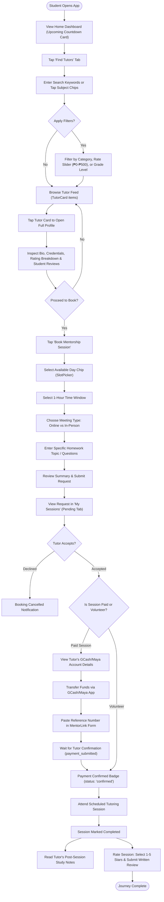
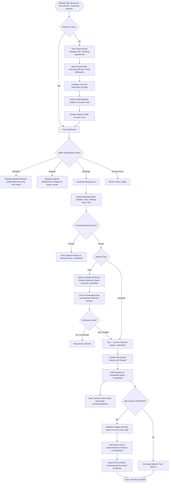
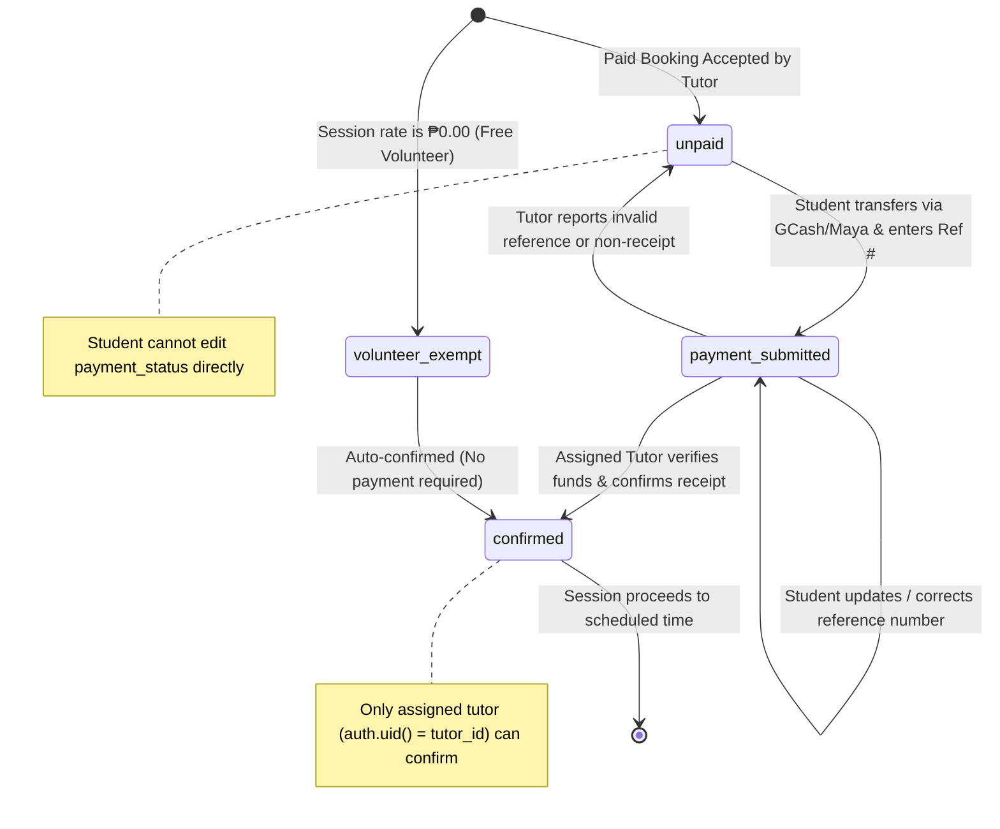
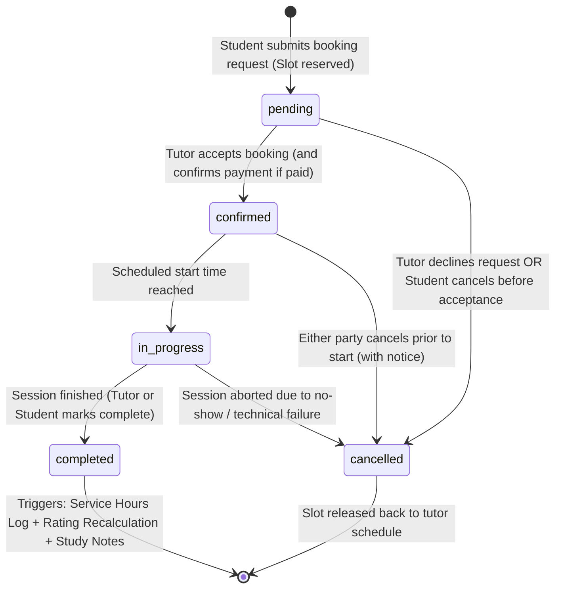
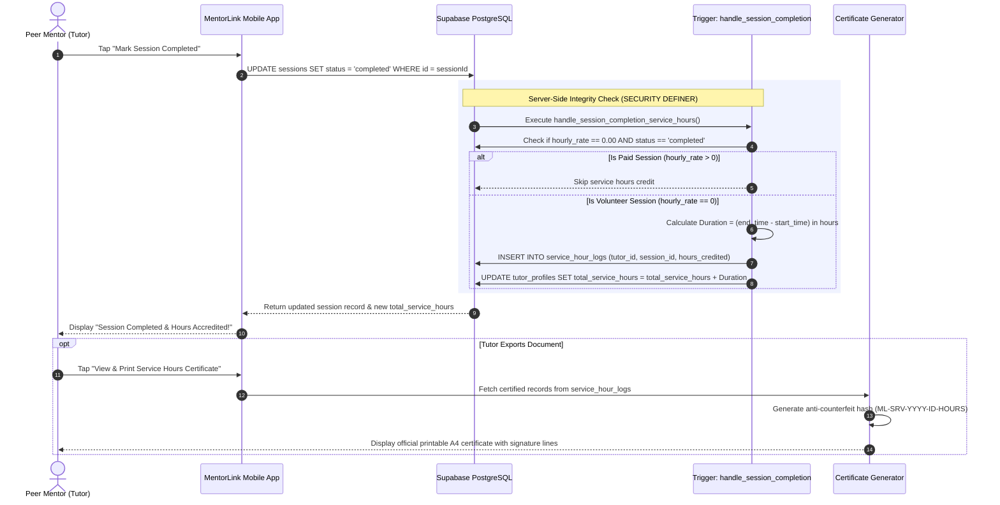

# MentorLink — System Flowcharts & Lifecycle State Diagrams

**Project Title:** MentorLink — Mentorship & Tutoring Matching Mobile Application  
**Document Purpose:** Comprehensive visual flowcharts, decision trees, and state machine diagrams mapping 100% of the end-to-end multi-role workflows across Students, Peer Tutors, Direct Payments, Database Triggers, and University Service Hours Accreditation.  
**Target Location:** `docs/system_flowchart.md`  
**Version:** 1.0  

---

## 1. Master End-to-End System Flowchart

This master diagram illustrates the complete bird's-eye lifecycle from user account creation to session completion, study notes, review submission, and university service hours crediting:

```mermaid
flowchart TD
    Start(["User Launches MentorLink"]) --> Auth{"Authenticated?"}
    Auth -- "No" --> Register["Sign Up / Login (High School or College)"]
    Auth -- "Yes" --> CheckRole{"Active Role Mode"}
    Register --> CheckRole

    %% Dual Role Routing
    CheckRole -- "Learner Mode" --> StudentDashboard["Student Home Dashboard"]
    CheckRole -- "Mentor Mode" --> TutorCheck{"is_tutor == true?"}

    TutorCheck -- "No" --> TutorOnboard["Tutor Setup Wizard (Set Bio, Rates, Subjects)"]
    TutorOnboard --> TutorDashboard["Tutor Dashboard"]
    TutorCheck -- "Yes" --> TutorDashboard

    %% Student Discovery & Booking Flow
    StudentDashboard --> Search["Find Tutors (Search & Filter by Subject, Rate, Day)"]
    Search --> ViewProfile["View Mentor Profile & Reviews"]
    ViewProfile --> SelectSlot["Select Weekly Slot (SlotPicker) & Enter Topic"]
    SelectSlot --> SubmitBooking["Submit Booking Request (status: 'pending')"]

    %% Tutor Response & Payment Branching
    SubmitBooking --> TutorNotification["Tutor Receives Booking Notification"]
    TutorDashboard --> ReviewBooking["Review Incoming Bookings"]
    TutorNotification --> ReviewBooking

    ReviewBooking --> TutorDecision{"Accept Booking?"}
    TutorDecision -- "Decline" --> BookingCancelled["Booking Cancelled (status: 'cancelled')"]
    TutorDecision -- "Accept" --> RateCheck{"Hourly Rate?"}

    %% Payment Lifecycle
    RateCheck -- "Paid (₱Rate/hr)" --> UnpaidState["status: 'pending', payment_status: 'unpaid'"]
    UnpaidState --> StudentTransfer["Student Transfers via GCash/Maya & Submits Ref #"]
    StudentTransfer --> RefSubmitted["payment_status: 'payment_submitted'"]
    RefSubmitted --> TutorVerify{"Tutor Verifies Ref in Payment App"}
    TutorVerify -- "Incorrect / Unpaid" --> UnpaidState
    TutorVerify -- "Payment Verified" --> ConfirmPaid["payment_status: 'confirmed', status: 'confirmed'"]

    RateCheck -- "Volunteer (₱0.00)" --> ConfirmVolunteer["status: 'confirmed' (Volunteer Service)"]

    %% Session Execution & Completion
    ConfirmPaid --> AttendSession["Attend 1-on-1 Tutoring Session (Online / In-Person)"]
    ConfirmVolunteer --> AttendSession

    AttendSession --> CompleteSession["Mark Session Completed (status: 'completed')"]

    %% Post-Session Outcomes (Parallel Triggers & Actions)
    CompleteSession --> PostNotes["Tutor Writes Post-Session Study Notes"]
    CompleteSession --> StudentReview["Student Submits 1-5 Star Rating & Review"]
    StudentReview --> TriggerRatings["Server Trigger: Recalculate Tutor Average Rating"]

    CompleteSession --> ServiceHoursCheck{"Was Session Volunteer (₱0)?"}
    ServiceHoursCheck -- "Yes" --> TriggerHours["Server Trigger: Commit to service_hour_logs & Increment Total Hours"]
    TriggerHours --> ExportCert["Tutor Exports / Prints Official Service Hours Certificate"]
    ServiceHoursCheck -- "No" --> EndState(["Session Finalized"])
    ExportCert --> EndState
```

---

## 2. Student (Learner) User Journey Flowchart

Detailed step-by-step decision flow for students seeking academic help:

---

## 3. Peer Tutor (Mentor) User Journey Flowchart

Detailed workflow for student tutors providing mentorship and earning accredited service hours:

---

## 4. Direct Payment Verification State Machine

State transitions for the simplified, direct peer-to-peer payment model:

---

## 5. Session Lifecycle State Machine

Complete transition rules for tutoring sessions in the `sessions` table:

---

## 6. University Community Service Hours Accreditation Flow

Shows the tamper-proof server-side database trigger commit for accredited volunteer hours:

---

## 7. Flowchart State & Role Consistency Matrix

| Flowchart | Initiating Role | Authorizing Role | Database Table Updated | Security Constraint Enforced |
| :--- | :--- | :--- | :--- | :--- |
| **Tutor Discovery** | Student | Public / Anyone | `tutor_profiles`, `tutor_subjects` | Active tutors only (`is_accepting_students = true`). |
| **Booking Submission** | Student | Student (`auth.uid()`) | `sessions` (`status = 'pending'`) | Anti-self-booking check (`student_id != tutor_id`). |
| **Payment Submission**| Student | Student (`auth.uid()`) | `sessions` (`payment_status = 'payment_submitted'`) | Can only update own session reference number. |
| **Payment Confirmation**| Tutor | Tutor (`auth.uid()`) | `sessions` (`payment_status = 'confirmed'`) | Student **cannot** confirm; only assigned tutor. |
| **Session Completion** | Tutor / Student | Both (`auth.uid()`) | `sessions` (`status = 'completed'`) | State transition requires existing `confirmed` status. |
| **Service Hours Credit**| Automated Trigger | Server (`SECURITY DEFINER`)| `service_hour_logs`, `tutor_profiles` | Zero client inserts permitted; committed strictly via trigger. |
| **Review Submission** | Student | Student (`auth.uid()`) | `reviews` | Unique constraint (`session_id`); completed sessions only. |
| **Rating Recalculation**| Automated Trigger | Server (`SECURITY DEFINER`)| `tutor_profiles.average_rating` | Automated arithmetic average over all reviews. |
